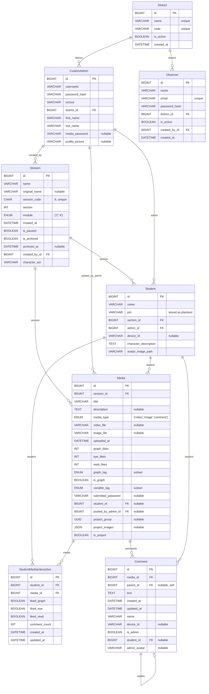

## DataDeck Architecture (Current Django Implementation)

### Purpose
DataDeck enables teachers to run classroom “sessions” where students upload data visualizations (images), react with badges (Graph/Eye/Read), and add comments. District-level observers can browse activity across teachers in their district.

### Roles
- **Teacher/Admin (`CustomAdmin`)**: Creates sessions, generates students, uploads/moderates media, manages districts and observers.
- **Student**: Logs in with PIN, uploads media or final projects, reacts with badges, comments.
- **Observer**: Logs in with email/password, views sessions and media for their district.

### Tech Stack (current)
- Django 5 (server-rendered HTML via templates)
- Database: MySQL (prod) / SQLite (dev/tests)
- Celery configured (scheduled clear-expired-sessions task); currently not required to run per README
- Static via Whitenoise; media stored on local filesystem
- Pytest for tests

### Key Features
- Session lifecycle: create, list, pause, archive/unarchive, delete
- Student generation: unique character name + PIN, avatar assignment from CSVs and images
- Media uploads: image upload (module 2), multi-image project gallery (module 4)
- Reactions/badges: Graph guru, Expert engager, Supreme storyteller
- Comments: nested replies, admin/student attribution
- Observer dashboard: view activity for district
- District/admin management: CRUD for districts and observers
- Student export: PDF cards with names and PINs

### Data Model
Mermaid ER diagram of the current Django entities and relationships:

### Route Inventory (current)
Key Django routes defined in `video_app/urls.py` and `datadeck/urls.py`:
- Auth: `/student-login/`, `/student-logout/`, `/admin/login/`
- Home: `/`
- Teacher: `/teacher_view/`, `/update_teacher_info/`, `/set-media-password/`
- Sessions: `/start-session/`, `/session/<id>/`, `/session/<id>/(delete|pause|archive)`, `/check-section-availability/`
- Students: `/student/<id>/`, `/delete-student/<id>/`, `/download-students/`, `generate_new_students`
- Media: `/upload/<session_id>/`, `/upload-project/<session_id>/`, `/edit-media/<id>/`, `/delete-media/<id>/`, `/like-media/<id>/<type>/`
- Posts: `/post/<media_id>/`
- Observer: `/observer/dashboard/`, `/observer/logout/`
- Admin Dashboard: `/admin-dashboard/` + District and Observer management helpers

### Core Flows (high-level)
- Teacher creates session → validate unique active hour → generate students → redirect to session
- Student logs in with PIN or join via `session_code` → sets `student_id` in session → redirect to session
- Upload media → validate form → attach poster (student/admin) → save file → create `Media`
- React (badge) → upsert `StudentMediaInteraction` → recalc media counts → return JSON
- Comment → create `Comment` (+ optional parent) → increment interaction `comment_count`
- Observer login → session flags `observer_id` → district dashboard view

### Security Model
- CSRF enabled for forms and AJAX
- Student PINs stored plaintext; Django user created with PIN as password on first login (improve in rewrite)
- Observer authentication via email+hashed password; restricted via middleware and decorators
- Access checks in views for deleting/editing media and comments

### Background Jobs
- `video_app.tasks.clear_expired_sessions`: delete sessions older than 7 days when not paused (scheduled daily)

### Static & Media
- Static assets in `video_app/static/`
- Media files stored under `/media` (local fs). Project images stored as URL strings in `Media.project_images` JSON

### Known Gaps / Risks
- Mixed reaction semantics (toggle vs single-select) across endpoints
- Student PINs not hashed; creates Django users dynamically
- Media storage local-only; lack of virus scanning and image resizing
- Observer/Teacher logins share `/admin/login/` path; UX and boundary can be clearer
- Error handling in file deletion is best-effort; no centralized storage abstraction

